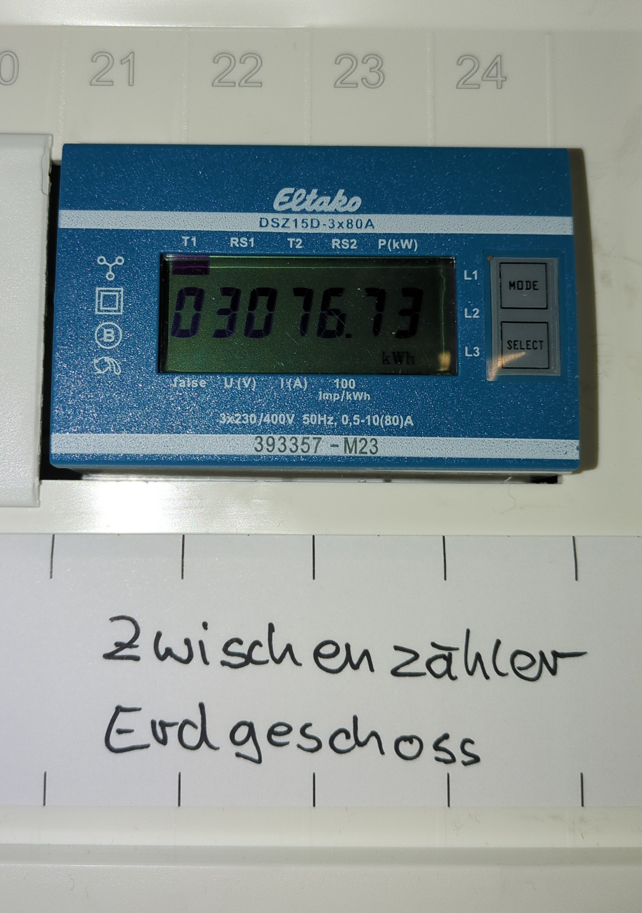
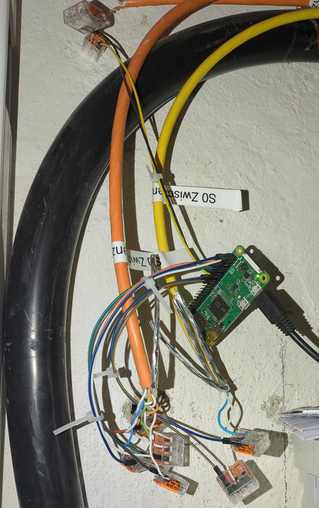

# Monitoring energymeters and SMA devices using a Rasperry Pi Zero

I live in a house with four flats, each of which is owned by a different member of my family.
In 2024 we jointly invested in a 23kWp photovoltaics (PV) system with 22kWh battery storage. To optimally use the energy
across the entire house, we now only have one contract (and one electricity meter) with the grid operator. Behind
the main meter, the consumption of each flat is measured using an Eltako electricity meter (as shown below) which we
use to split the electricity cost.

With a PV system (and maybe in the future, dynamic tariffs), the cost per kWh is not fixed. It is basically
free when there's sun and expensive otherwise. Thus ideally, we could not only record _how much_ energy is consumed,
but also _when_. Like that we can learn more about our energy consumption, optimize it towards consuming more
self-generated energy, and split the cost more accurately.

|  |  |

A simple service to monitor multiple energymeters with a Rasperry Pi via the S0 protocol and store all pulses in a sqlite database.
It can also read out modbus registers of some SMA devices (tested with Sunny Tripower inverter and Sunny Island battery).

## Hardware setup

According to the S0 protocol, on pulse is sent by the energymeter every time a certain unit of energy is consumed.
This value depends on the meter.

Of each energy meter, the S0- port is connected to the GND of the raspberry pi. The S0+ port to any of
the GPIO ports.

GPIO ports must be set to Pull-up. We can then detect a falling edge signal.

## Configuration

Additional energy meters, and their GPIO ports can be added to `config.yml`. The service needs to be restarted
after any change. The `Imp` key defines the impluses sent by the energymeters per kWh. It is not relevant
for this logging service as we just count pulses. It is relevant later for the conversion to kWh.

The output database can also be set in the config file.

## Dependencies

-   `pip install pyyaml sqlalchemy`
-   Python >= 3.9

## How it works

-   `monitor.py` is a simple python script that waits for events being detected on any of the GPIO ports. On every event,
    an entry is written to the database.
-   `service.sh` is a wrapper script called by the systemd service
-   `energymonitor.service` is a systemd service file, that needs to be put into `/etc/systemd/system`.

To activate the service call

```
systemctl enable energymonitor.service
systemctl start energymonitor.service
```

It will be started automatically after a reboot.

Check the status with

```
systemctl status energymonitor.service
```
